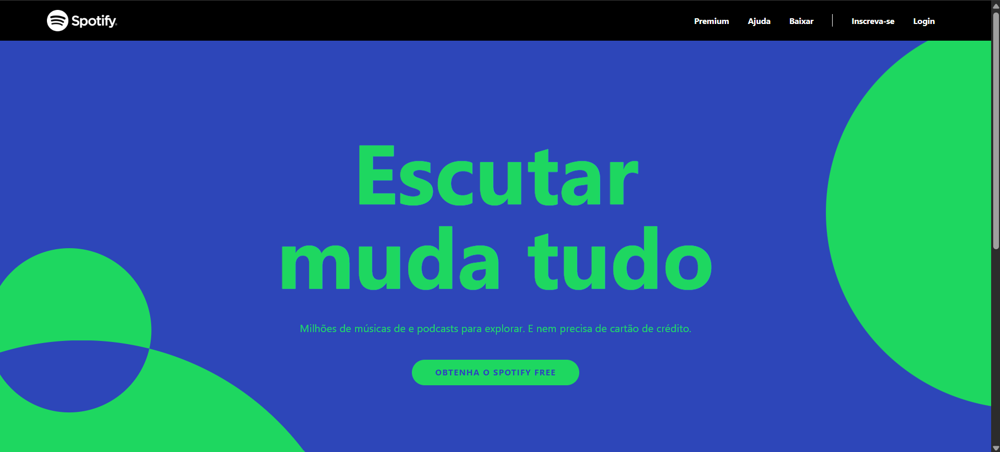

# 🎵 Clone da Página Inicial Antiga do Spotify

Este projeto é um **clone da antiga home page do Spotify**, criado com o objetivo de praticar e demonstrar o uso de **Tailwind CSS** para construção de interfaces modernas, responsivas e com código limpo.

---

## 🧪 Tecnologias Utilizadas

- **HTML5**
- **Tailwind CSS**  

---

## 🎯 Objetivo

O principal objetivo deste projeto é aplicar os conhecimentos em **Tailwind CSS**, recriando uma interface visualmente próxima da antiga página inicial do Spotify.

Isso inclui a estrutura da página, estilização, responsividade e boas práticas com a utility-first approach do Tailwind.

---

## 📸 Prévia do Projeto

Exemplo:

